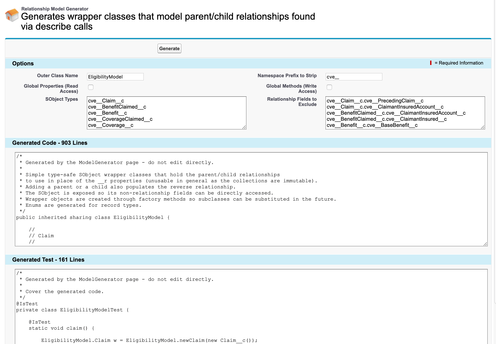

# relationship-model-generator

## Introduction

When SObjects are queried in a single query, their parent-child `__r` fields are populated and can be used to navigate from one object to the other. But SOQL doesn't allow a deep tree of objects to be queried in one go, and the collection `__r` fields are immutable.

This Visualforce page code generator produces an inner class per SObject that wraps the SObject and adds fields to model the parent and child relationships. Convenience methods are included to connect up parent or child objects and ensure that the relationship fields are set. A test class is also generated, primarily to ensure the generated code has test coverage.

Use this unchanged or clone and make your own changes. The code is generic - there are just a few default values tied to our specific objects. We are not looking for contributions, but rather just sharing some code that may be useful to others.

## Screenshot



## Sample code output

This is the first part of some code generated by this page that illustrates the resulting patterns:

```
/*
 * Generated by the ModelGenerator page - do not edit directly.
 * 
 * Simple type-safe SObject wrapper classes that hold the parent/child relationships
 * to use in place of the __r properties (unusable in general as the collections are immutable).
 * Adding a parent or a child also populates the reverse relationship.
 * The SObject is exposed so its non-relationship fields can be directly accessed.
 * Wrapper objects are created through factory methods so subclasses can be substituted in the future.
 * Enums are generated for record types.
 */
public inherited sharing class EligibilityModel {

    //
    // Claim
    //

    // Factory method
    public static Claim newClaim(Claim__c sob) {
        Claim w = new Claim();
        w.sob = sob;
        return w;
    }

    // Wrapper class
    public class Claim {

        // Wrapped object
        public Claim__c sob {get; private set;}

        // Parent wrapper object relationships
        public ContactWrapper claimantInsured {get; private set;}
        public Policy policy {get; private set;}

        // Child wrapper object relationships
        public BenefitClaimed[] benefitClaimeds {
            get {
                if (benefitClaimeds == null) benefitClaimeds = new BenefitClaimed[] {};
                return benefitClaimeds;
            }
            private set;
        }
        public ClaimRelationship[] claimRelationships {
            get {
                if (claimRelationships == null) claimRelationships = new ClaimRelationship[] {};
                return claimRelationships;
            }
            private set;
        }
        public Journal[] journals {
            get {
                if (journals == null) journals = new Journal[] {};
                return journals;
            }
            private set;
        }
        public PaymentSpecification[] paymentSpecifications {
            get {
                if (paymentSpecifications == null) paymentSpecifications = new PaymentSpecification[] {};
                return paymentSpecifications;
            }
            private set;
        }

        // Create via factory method only
        private Claim() {
        }

        // Parent object methods
        public ContactWrapper setParentClaimantInsured(Contact sob) {
            ContactWrapper w = sob != null ? newContactWrapper(sob) : null;
            claimantInsured = w;
            if (w != null) w.claims.add(this);
            return w;
        }
        public Policy setParentPolicy(Policy__c sob) {
            Policy w = sob != null ? newPolicy(sob) : null;
            policy = w;
            if (w != null) w.claims.add(this);
            return w;
        }

        // Child object methods
        public BenefitClaimed addChildToBenefitClaimeds(BenefitClaimed__c sob) {
            if (sob == null) return null;
            BenefitClaimed w = newBenefitClaimed(sob);
            benefitClaimeds.add(w);
            w.claim = this;
            return w;
        }
        public ClaimRelationship addChildToClaimRelationships(ClaimRelationship__c sob) {
            if (sob == null) return null;
            ClaimRelationship w = newClaimRelationship(sob);
            claimRelationships.add(w);
            w.claim = this;
            return w;
        }
        public Journal addChildToJournals(Journal__c sob) {
            if (sob == null) return null;
            Journal w = newJournal(sob);
            journals.add(w);
            w.claim = this;
            return w;
        }
        public PaymentSpecification addChildToPaymentSpecifications(PaymentSpecification__c sob) {
            if (sob == null) return null;
            PaymentSpecification w = newPaymentSpecification(sob);
            paymentSpecifications.add(w);
            w.claim = this;
            return w;
        }
    }

    //
    // BenefitClaimed
    //

    // Record type enum
    public enum BenefitClaimedRecordType {
        Accident,
        AccidentalDeathAndDismemberment,
        Annuity,
        Cancer,
        CriticalIllness,
        HospitalIndemnity,
        IncomeProtection,
        Indemnity,
        LongTermCare,
        LongTermDisability,
        ShortTermDisability,
        Survivor,
        TermLife,
        TotalAndPermanentDisability,
        UniversalLife,
        WaiverOfPremium,
        Wellness,
        WholeLife
    }

    // Record type enum lookup
    public static BenefitClaimedRecordType toBenefitClaimedRecordType(String developerName) {
        for (BenefitClaimedRecordType e : BenefitClaimedRecordType.values()) {
            if (e.name() == developerName) return e;
        }
        return null;
    }

    // Factory method
    public static BenefitClaimed newBenefitClaimed(BenefitClaimed__c sob) {
        BenefitClaimed w = new BenefitClaimed();
        w.sob = sob;
        return w;
    }

    // Wrapper class
    public class BenefitClaimed {

        // Wrapped object
        public BenefitClaimed__c sob {get; private set;}
        public BenefitClaimedRecordType recordType {get; private set;}

        // Parent wrapper object relationships
        public Claim claim {get; private set;}
        public Benefit benefit {get; private set;}
        public Journal latestJournal {get; private set;}
        public PaymentSpecification latestPaymentSpecification {get; private set;}
        public Policy policy {get; private set;}

        // Child wrapper object relationships
        public CoverageClaimed[] coveragesClaimed {
            get {
                if (coveragesClaimed == null) coveragesClaimed = new CoverageClaimed[] {};
                return coveragesClaimed;
            }
            private set;
        }
        public Journal[] journals {
            get {
                if (journals == null) journals = new Journal[] {};
                return journals;
            }
            private set;
        }
        public PaymentSpecification[] paymentSpecifications {
            get {
                if (paymentSpecifications == null) paymentSpecifications = new PaymentSpecification[] {};
                return paymentSpecifications;
            }
            private set;
        }

        // Create via factory method only
        private BenefitClaimed() {
        }

        // Set the record type starting from the developer name
        public BenefitClaimedRecordType setRecordType(String developerName) {
            recordType = toBenefitClaimedRecordType(developerName);
            return recordType;
        }

        // Parent object methods
        public Claim setParentClaim(Claim__c sob) {
            Claim w = sob != null ? newClaim(sob) : null;
            claim = w;
            if (w != null) w.benefitClaimeds.add(this);
            return w;
        }
        public Benefit setParentBenefit(Benefit__c sob) {
            Benefit w = sob != null ? newBenefit(sob) : null;
            benefit = w;
            if (w != null) w.benefitClaimeds.add(this);
            return w;
        }
        public Journal setParentLatestJournal(Journal__c sob) {
            Journal w = sob != null ? newJournal(sob) : null;
            latestJournal = w;
            if (w != null) w.benefitClaimeds.add(this);
            return w;
        }
        public PaymentSpecification setParentLatestPaymentSpecification(PaymentSpecification__c sob) {
            PaymentSpecification w = sob != null ? newPaymentSpecification(sob) : null;
            latestPaymentSpecification = w;
            if (w != null) w.benefitClaimeds.add(this);
            return w;
        }
        public Policy setParentPolicy(Policy__c sob) {
            Policy w = sob != null ? newPolicy(sob) : null;
            policy = w;
            if (w != null) w.benefitClaimeds.add(this);
            return w;
        }

        // Child object methods
        public CoverageClaimed addChildToCoveragesClaimed(CoverageClaimed__c sob) {
            if (sob == null) return null;
            CoverageClaimed w = newCoverageClaimed(sob);
            coveragesClaimed.add(w);
            w.benefitClaimed = this;
            return w;
        }
        public Journal addChildToJournals(Journal__c sob) {
            if (sob == null) return null;
            Journal w = newJournal(sob);
            journals.add(w);
            w.benefitClaimed = this;
            return w;
        }
        public PaymentSpecification addChildToPaymentSpecifications(PaymentSpecification__c sob) {
            if (sob == null) return null;
            PaymentSpecification w = newPaymentSpecification(sob);
            paymentSpecifications.add(w);
            w.benefitClaimed = this;
            return w;
        }
    }
    
    ...
```
## Sample test output
```
/*
 * Generated by the ModelGenerator page - do not edit directly.
 * 
 * Cover the generated code.
 */
@IsTest
private class EligibilityModelTest {

    @IsTest
    static void claim() {
        EligibilityModel.Claim w = EligibilityModel.newClaim(new Claim__c());
        System.assertNotEquals(null, w.setParentClaimantInsured(new Contact()));
        System.assertNotEquals(null, w.setParentPolicy(new Policy__c()));
        System.assertNotEquals(null, w.addChildToBenefitClaimeds(new BenefitClaimed__c()));
        System.assertNotEquals(null, w.addChildToClaimRelationships(new ClaimRelationship__c()));
        System.assertNotEquals(null, w.addChildToJournals(new Journal__c()));
        System.assertNotEquals(null, w.addChildToPaymentSpecifications(new PaymentSpecification__c()));
    }

    @IsTest
    static void benefitClaimed() {
        EligibilityModel.BenefitClaimed w = EligibilityModel.newBenefitClaimed(new BenefitClaimed__c());
        System.assertNotEquals(null, w.setParentClaim(new Claim__c()));
        System.assertNotEquals(null, w.setParentBenefit(new Benefit__c()));
        System.assertNotEquals(null, w.setParentLatestJournal(new Journal__c()));
        System.assertNotEquals(null, w.setParentLatestPaymentSpecification(new PaymentSpecification__c()));
        System.assertNotEquals(null, w.setParentPolicy(new Policy__c()));
        System.assertNotEquals(null, w.addChildToCoveragesClaimed(new CoverageClaimed__c()));
        System.assertNotEquals(null, w.addChildToJournals(new Journal__c()));
        System.assertNotEquals(null, w.addChildToPaymentSpecifications(new PaymentSpecification__c()));
        System.assertEquals(EligibilityModel.BenefitClaimedRecordType.Accident, w.setRecordType('Accident'));
        System.assertEquals(EligibilityModel.BenefitClaimedRecordType.WholeLife, EligibilityModel.BenefitClaimed.toBenefitClaimedRecordType('WholeLife'));
    }
    
    ...
```
